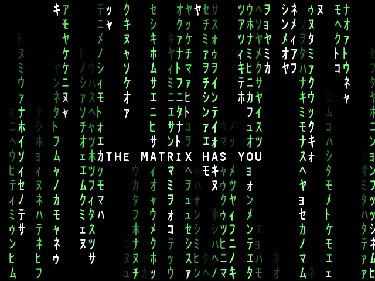

TypographiaLib - A simple C++ library for font drawing
======================================================

Overview
-------

* **Version**: 1.00 Alpha
* **License**: [3-Clause BSD License](https://github.com/LukasBanana/GaussianLib/blob/master/LICENSE.txt)


Dependencies
------------

Building this library requires the [FreeType Project](https://www.freetype.org/)


Screenshots
-----------

<p align="center">Example with <b>TextFieldString</b>, and <b>MultiLineString</b>:</p>
<p align="center"></p>

<p align="center">Screenshot of the <b>Matrix Digital Rain</b> example (see it on <a href="https://www.youtube.com/watch?v=CAV1fQeAozo">YouTube</a>):</p>
<p align="center"></p>


Example
-------

```cpp
#include <Typo/Typo.h>

int main()
{
    /*
    Build font with size 60 pixels.
    This will generate a font atlas image with tightly packed font glyphs.
    */
    auto fontModel = Tg::BuildFont({ "MyFontFile.ttf", 60 });
    
    //store font atlas image 'fontModel.image' ...
    //  use 'fontModel.image.GetSize()',
    //  and 'fontModel.image.GetImageBuffer()',
    //  and 'fontModel.glyphSet'.
    
    /*
    Text field example. In a model-view-controller pattern, the "TextFieldString"
    is a model to easily manage a user input text field (like in a command line).
    */
    Tg::TextFieldString textField;

    textField += "Hello, World";
    textField.MoveCursorBegin();     std::cout << std::string(textField) << std::endl;
    textField.MoveCursor(3);         std::cout << std::string(textField) << std::endl;
    textField.RemoveSequenceRight(); std::cout << std::string(textField) << std::endl;
    textField.Put(char(127));        std::cout << std::string(textField) << std::endl;
    textField.Put("ABC");            std::cout << std::string(textField) << std::endl;
    
    return 0;
}
```

Font Atlas Image Examples
-------------------------

<p align="center">Times New Roman, 34px, Glyphs [32, 255]:</p>
<p align="center"></p>

<p align="center">Kaiu, 34px, Glyphs [0x8C22, 0x8C35]:</p>
<p align="center"></p>

<p align="center">Edwardian Script ITC, 60px, Glyphs [32, 128]:</p>
<p align="center"></p>
